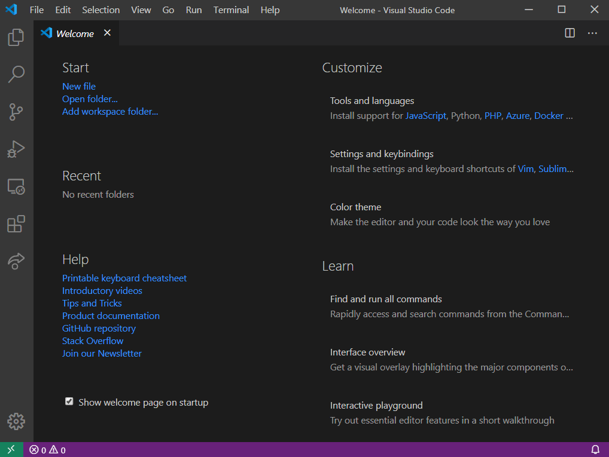

# Dingo Visual Studio Code Extension

## Features

This extension allows you to download and open a git repository directly from VS Code.

The following repository locations/formats are supported:
- NPM package name (e.g. `lodash`)
- Github repository URL (e.g. `https://github.com/lodash/lodash`)
- Git HTTP endpoint (e.g. `https://github.com/lodash/lodash.git`)
- Git SSH endpoint (e.g. `git@github.com:lodash/lodash.git`)

## Using

To use the extension, simply run the command `Dingo: Open`.

## License

Dingo is licensed under an [MIT license](LICENSE).

## About

Dingo is brought to you with ❤️love❤️ by the Wallaby.js team. While working on our 
[Wallaby.js](https://wallabyjs.com/) and [Quokka.js](https://quokkajs.com/) products, 
time after time we found ourselves performing the same steps: find repo for npm package, 
clone repo, install dependencies, and then open in new instance of VS Code. We created 
Dingo to simplify this process and hope that others will also find it useful.

## Contributing

Please read our [Contributing guide](CONTRIBUTING.md).